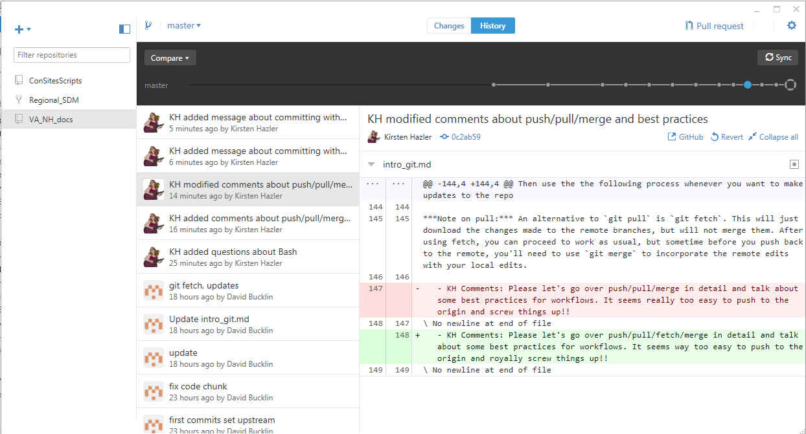

# Working with git (and GitHub)

#### Download git ([https://git-scm.com/downloads](https://git-scm.com/downloads))

- This will allow you to use git locally in a command-line or GUI interface

   KH Comment: I am not fluent with it yet, but I do like the GUI for the ability to see the changes made, very clearly.
   

- It will work with any repository system using git version control (GitHub is the most common)

- During install, set the options to interface with git "using Git Bash only". This means you will use git with a dedicated command line interface (called the “Git Bash” shell) rather than the general windows command line.

- Once installed, open the Git Bash shell:

  


There are a couple important global settings you'll want to set the first time you use Git Bash. These include your name and e-mail address, and the default text editor to open when needed. Set these with the following commands.

```
git config --global user.name "John Doe"

git config --global user.email john.doe@domain.com

git config --global core.editor "'C:/Program Files/Notepad++/notepad++.exe' -multiInst -notabbar -nosession -noPlugin"
```

The last command sets Notepad++ as the default text editor. You can change to whatever editor you'd like by altering the path.

In git bash, you can navigate and manipulate your file/folder system using basic commands. The most important is `cd`, which is used to change the current directory. For example, if you create a folder `E:/git` to hold all of your git repositories locally, you can navigate to it with:

```
cd E:/git
```

All git-commands start with a `git` call, e.g., `git pull`. In Git Bash, you can view most useful git commands with the call:

```
git --help
```

## Starting with a new, local repository

*Note: if you're just working with an existing (GitHub) repository, skip to the **Working with existing repositories** section*.

Any folder can be initialized as a new git repository. For example, to create a new **local** repository `VA_NH_docs` to store this document and other helpful tools for the organization, we can use the commands:

```
git init VA_NH_docs 
```

That creates a new folder, which we now navigate to:

```
cd VA_NH_docs
```

Git bash will now indicate that you are in a git repository, since it will show the current branch you are using (by default in a new repostory, this is called `master`) in parentheses in blue lettering.

You can now add folders/files to this repository. For example, this document `intro_git.md`  and associated images are added to the folder. It's also a  good idea to always create a file called `README.md` file directly in a repository folder, which will automatically display on the main repository page on GitHub. 

#### Link local repository to a remote

Once you're ready to add the repository to GitHub, you'll need to create a new, completely empty repository on GitHub (the **remote**) there with the same name (`VA_NH_docs`) as the local repository. 

Once it's created, we can tell git where the remote GitHub repository is located:

```
git remote add origin https://github.com/VANatHeritage/VA_NH_docs.git
```

This tells git to add a new remote repository link, with the name `origin`. This only needs to be done once for each remote (generally, you'll only have one, and it's a good idea to name it `origin`).

#### Add and commit changes locally

Now we can **add** and **commit** the changes we've made to the repository locally. Adding *stages* the changed files, while committing finalizes the changes to a tagged and commented **commit**.

You can add one file/folder at a time, or add all changed files using `*`.

```
git add *
```

You can view the current status of your repository at any time by typing the command `git status`. If you run it after the previous add command, you'll see that all files are ready to be committed, and you can do so with:

```
git commit
```

A new text editor window should pop up, where you can add a message (details) to the commit. An empty message will abort the commit, so make sure to write something.

#### Push local changes to the remote

Now that the changes are committed locally, you can **push** them to the remote repository.

Before the first push of changes to an empty remote repository, you need to tell git which branch on the remote matches to your current branch (here, `master`):

```
git push --set-upstream origin master
```

Now the remote repository is up-to-date with our local one.

## Working with existing repositories

#### If you want to create a new local repository from an existing (GitHub) remote repository

Navigate to where you want to create a local repository (e.g., `cd E:/git`). 

Then use `git clone`, which will copy the existing remote repository to a new folder with the same name locally.

```
git clone https://github.com/VANatHeritage/Regional_SDM.git
```

Cloning the repository in this way allows git to automatically know the `remote` source location and branches of the repository (as opposed to when creating a new local repository using `git init` as described in the previous section).  After the clone copies the repository to your local, you can proceed to use the general git process to make changes to the repository.

#### General git process

When you start working on a repository locally, open Git Bash and navigate to the local repository (e.g., `cd E:/git/VA_NH_docs`). 

If the repository has multiple branches, and you want to work on a different branch than is currently displayed, use:

```
git checkout branch-name
```

to move to the branch you want to work on. Then use:

```
git pull
```

which will both **pull** and **merge** (download and incorporate) all changes from the remote to our local repository. Note that this command only merges updates for the current branch that you're working with.

Then use the the following process whenever you want to make updates to the repository:

- make any edits to files/folders
- use `git add *` to *stage* all of the changes locally
- use `git commit` to *commit* all the changes locally
  - make sure to add a commit message (describing the updates you've made) to the notepad file that pops up. An empty message will abort the commit.
  - `git commit -m 'commit message here'`: add commit message directly in command line rather than composing the message in the text editor
- use `git push` to *push* all the changes to the remote repository


***Note on pull:*** An alternative to `git pull` is `git fetch`. This will just download the changes made to the remote branches, but will not merge them. After using fetch, you can proceed to work as usual, but sometime before you push back to the remote, you'll need to use `git merge` to incorporate the remote edits with your local edits.

### Good to know

`git status` : check your current working directory status

`git branch`: list all branches in the repository; `git branch -d [branch_name]` deletes it locally
- to delete a remote branch: `git push origin :[branch_name]`
  - *note*: GitHub will not allow you to delete the default remote branch (generally `master`). To delete it, first change the default branch on GitHub (main repo webpage -> Branches)
- `git branch -m [branch] [new_branchname]` : rename a branch

`git remote -v`: list remotes for a repository

`git diff`: compare your working directory to the latest commit (changes are highlighted)

##### Merge locally

If you are working on a branch (e.g., `working`) and want to merge to another (e.g., `master`), without using a GitHub pull request. 

First commit all your changes to the `working` branch. Then:

```
git checkout master
git merge working
git push
```

##### Merge on GitHub (pull request)

If instead you want to merge on GitHub, again commit all your changes to `working`. Then just `git push` it to the `working` remote tracking branch on GitHub. Use GitHub's pull request button to merge `working` into `master`.

##### Tagging ([doc](https://git-scm.com/book/en/v2/Git-Basics-Tagging))

After an important update to a branch, or when you want to apply a version, you can add a tag. You can do this after you've already committed and pushed your updates to the origin (GitHub). For example, if you've just pushed important changes to the `master` branch and want to call it version 1.0, use:

```
git tag v1.0
```

Instead, if you wanted to add more information about the tagging point, use an *annotated* (`-a`) tag with a message (`-m`):

```
git tag -a v1.0 -m "First stable release version 1.0"
```

After applying the tags, you need to specifically push them (this is separate from a regular `git push` for the branch):

```
git push origin --tags
```

Now your tags will appear next to your list of branches on GitHub.

